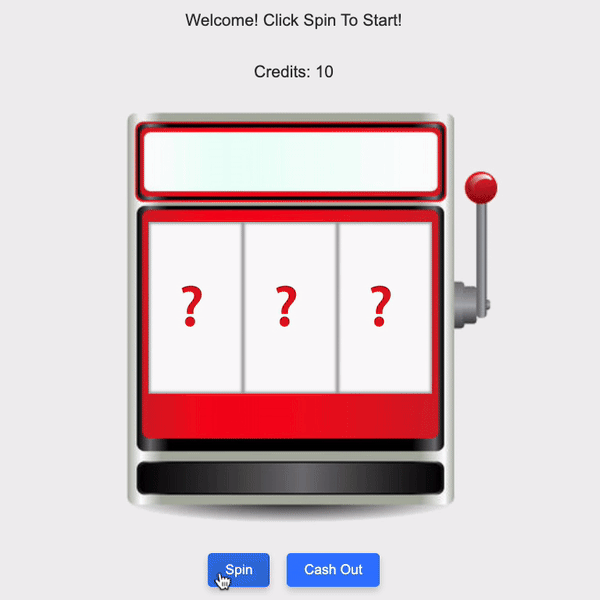

<h1 align="center">Casino Jackpot Game</h1>
<p align="center">
  
</p>
<br>
Casino Jackpot Game by Sagi Weizmann
<br>
This is a simple slot machine game implemented in Symfony 7.1.0
The game allows users to spin a slot machine, win or lose credits, and cash out their winnings.

## Table of Contents
1. [Project Overview](#project-overview)
2. [Assignment Readme](Assignment_README.md)
3. [Running the Project](#running-the-project)
4. [Development Journey](#development-journey)
    - [Initial Setup](#initial-setup)
    - [Refactoring](#refactoring)
    - [Service Layer](#service-layer)
    - [Challenges and Solutions](#challenges-and-solutions)
5. [Endpoints And Responses](#endpoints-and-responses)

## Project Overview
The game logic is implemented in PHP using the Symfony framework, and the frontend is handled using jQuery.

## Running the Project

Be aware that you need PHP 8.2.0 or higher to run this project.
The Symfony CLI is also required to start the server.
The Symfony version used in this project is 7.1.0.

1. **Clone the repository:**
   ```bash
   git clone https://github.com/your-repo/slot-machine-game.git

2. **Install dependencies:**
   ```bash
    composer install

3. **Run the Symfony server:**
    ```bash
    symfony server:start

4. **Access the game in your browser:**
   Open `http://localhost:8000` in your browser to play the slot machine game.

## Development Journey

#### Initial Setup
The project began with a basic setup, where the game logic was embedded directly within the controller. The symbols and their corresponding rewards were defined as simple arrays. The game had three primary functionalities: start, spin, and cash out.

#### Refactoring of the code
To improve code maintainability and readability, the reward system was refactored to use enums. This refactoring allowed us to define `SlotSymbolEnum` for the symbols and `SlotRewardEnum` for the corresponding rewards.
its made the code more self-explanatory.

The `SlotMachineService` was introduced to handle all game-related logic, including managing symbols, calculating rewards, and updating the user's credits.

- **SlotMachineService:** Encapsulates the core logic for the slot machine game, such as spinning the slots, determining wins, and calculating rewards.

I had to explicitly inject `SessionInterface` into the `SlotMachineService` constructor.

#### Challenges and Solutions

- **Frontend Slot machine spinning:** Implementing the spinning effect for the slot machine blocks was challenging. I used jQuery to animate the spinning effect, whic invovled many symbols going up in a random offest and then coming back down to the original position.

- **Service Injection:** The session service was not autowired by default, causing errors. This was fixed by manually injecting the session into the `SlotMachineService`.

- **Enum to Integer Conversion:** While using enums for rewards, a type error occurred due to the inability to directly add enums to integers. because of PHP 8 Strict Types. This was resolved by casting the enum to an integer before performing arithmetic operations.

## Endpoints and Responses

### `/start` - GET
- **Description:** Initializes the game session with starting credits.
- **Response:**
  ```json
  {
    "credits": 10
  }

### `/roll` - POST
- **Description:** Spins the slot machine, deducting 1 credit per spin. Returns the result of the spin, including the symbols, win status, reward, and updated credits.
- **Response:**
  ```json
  {
    "symbols": ["🍒", "🍋", "🍊"],
    "win": true,
    "reward": 30,
    "credits": 39
  }
  
### `/cash-out` - POST

- **Description:** Transfers the credits from the game session to the user's account and closes the session.
- **Response:**
  ```json
    {
    "cashed_out": 50
    }